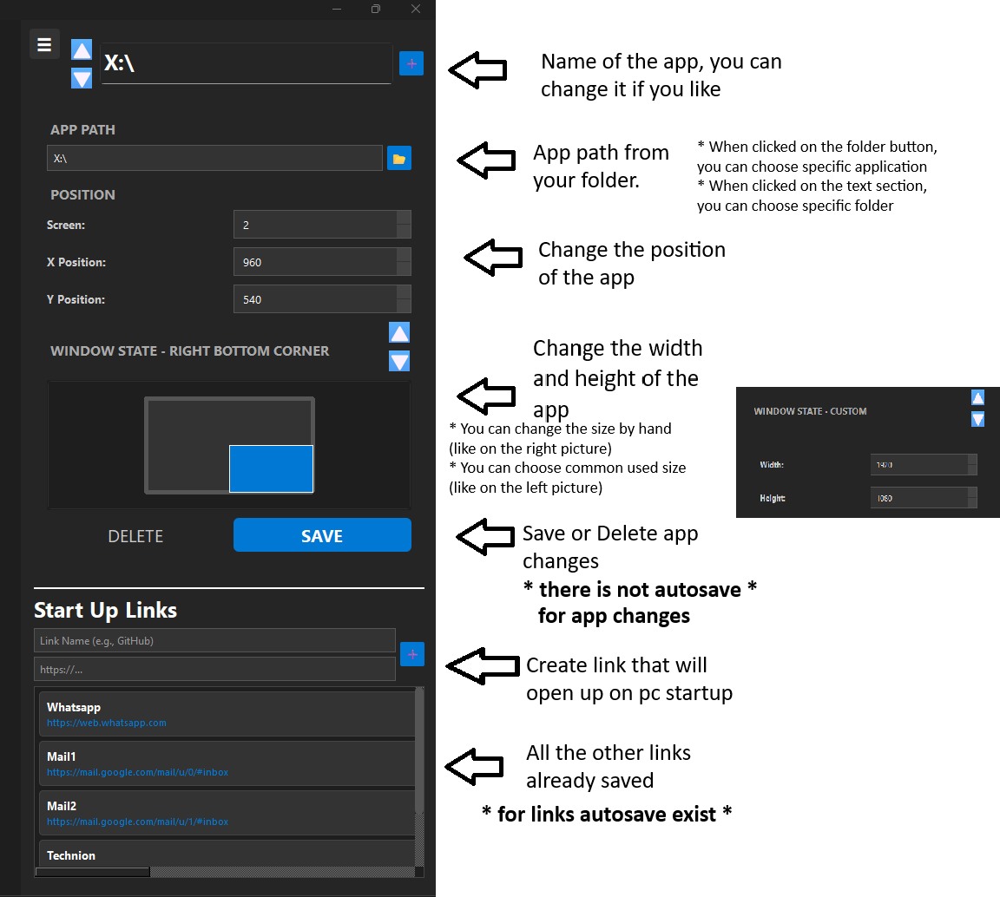

# **Starton Environment - Beta**

This is python bases desktop application that meant to help with creating your environment on starting the computer.
What it means? Now you can decide what apps(size and position) and what links and tabs will open on your screen when you turn on your computer.
**--- (On Windows only) ---**
**--- (Must have python 3.12+) ---**
**--- (This project is still in Beta version) ---**
**--- (May contian bugs) ---**

## **Recommendations**:
1) In windows settings, apps -> Startup, unable all startup applications

2) In startup folder, delete all applications. Use win+R key and type: shell:startup

## To Setup Application:
1) Copy the path of requirements.txt from this project
2) Open cmd and type: pip install -r <requirements.txt path>
3) Run SetupGUI.exe from this project
4) That is it.

## Things to do in the Application:
* If there isnt an app, you can open the info panel, then add new app with the + button 
* You can close and open the info panel whenever you want
The Info PaneL:

* You can also change position and resize the application in the canvas by hand:
Canvas:

*When you created all your setup environment ypu can close the app.*
*When you reopen your pc this environment will show up*

## How to delete:
If you want to delete this application
1) Delete it like a usual git clone.
2) Go to startup folder: Use win+R key and type: shell:startup, and delete "launch_apps.bat" file

## **A LITLE BIT ABOUT THE PROJECT**
I wanted to setup my environment on my computer.
But every time i closed and opened the computer, I needed to create this env again, it would take me 5 minutes at least.
So I created this project for that, create your env one time and it will work a million more.

This project I could separate into 2 pieces, the opening part(OnSetup.py) and the desktop application part(SetupGUI.py)
For the UI/UX I used PyQt6 library and it is the most used in this project.
This library has the basic widgets from QtWidgets but with a twist of styling with css.
Moreover, i could preform event listener for my ux with this library's built in functions, from QtGui.
Thats it. Take a look at the project
**--- (This project is still in Beta version) ---**
**--- (May contian bugs) ---**
